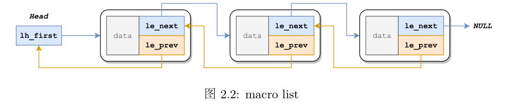
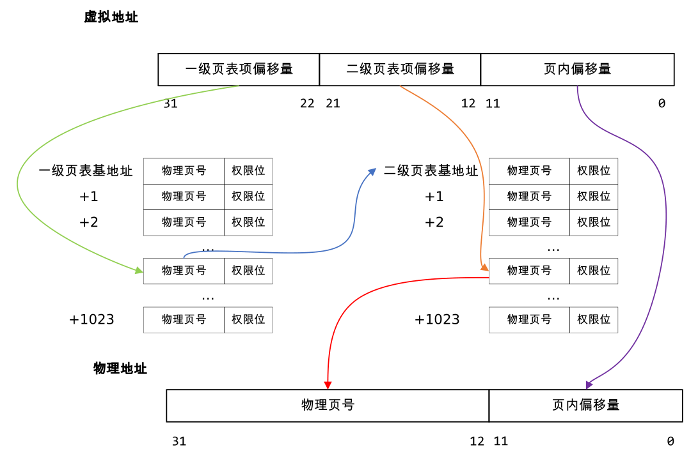

**目录**
[TOC]
---

# 思考题

## Thinking 2.1

C程序和MIPS汇编程序中使用的都是虚拟地址。

## Thinking 2.2

- 设计宏来实现链表，可以做到“泛型”链表，方便反复使用。

- 在头文件开头的注释中有说明：

  > A list is headed by a single forward pointer(or an array of forward pointers for a hash table header). The elements are doubly linked so that an arbitrary element can be removed without a need to traverse the list. New elements can be added to the list before or after an existing element or at the head of the list. A list may only be traversed in the forward direction.

  > A tail queue is headed by a pair of pointers, one to the head of the list and the other to the tail of the list. The elements are doubly linked so that an arbitrary element can be removed without a need to traverse the list. New elements can be added to the list before or after an existing element, at the head of the list, or at the end of the list. A tail queue may only be traversed in the forward direction.

  > A circle queue is headed by a pair of pointers, one to the head of the list and the other to the tail of the list. The elements are doubly linked so that an arbitrary element can be removed without a need to traverse the list. New elements can be added to the list before or after an existing element, at the head of the list, or at the end of the list. A circle queue may be traversed in either direction, but has a more complex end of list detection.

## Thinking 2.3

本题选C.

## Thinking 2.4

- 同一虚拟地址在不同的地址空间中通常映射到不同的物理地址. 因此在虚拟内存的实现中，需要对每个进程的地址空间进行标识，查找 TLB 表项时，除了需要提供 VPN，还需要提供ASID。
- ASID共有六位，则可以容纳$2^6=64$个不同的地址空间。

## Thinking 2.5

- `tlb_out`被`tlb_invalidate`调用。

- `tlb_invalidate`的作用是删除特定虚拟地址在TLB中的旧表项。

- 本小问以逐行注释的形式作答：

  ```assembly
  // 引入函数的宏
  LEAF(tlb_out)
  // 告知汇编器关闭指令重排
  .set noreorder
  // 保存旧的ENTRYHI数据
  	mfc0    t0, CP0_ENTRYHI
  // 将新的ENTRYHI数据移入寄存器
  	mtc0    a0, CP0_ENTRYHI
  // 延迟槽
  	nop
  // 根据ENTRYHI查找页表项，并将索引存入Index
      tlbp
  // 延迟槽
  	nop
  // 获得索引查询结果
  	mfc0    t1, CP0_INDEX
  // 告知汇编器开启指令重排
  .set reorder
  // 若未查询到索引, 跳转到相应的处理函数
  	bltz    t1, NO_SUCH_ENTRY
  // 告知汇编器关闭指令重排
  .set noreorder
  // 若查询到索引，重置ENTRYHI
  	mtc0    zero, CP0_ENTRYHI
  // 重置ENTRYHI
  	mtc0    zero, CP0_ENTRYLO0
  // 延迟槽
  	nop
  // 向ENTRYHI和ENTRYLO写入索引对应的页表项
      tlbwi
  // 告知汇编器开启指令重排
  .set reorder
  // 未查询到索引的处理函数入口
  NO_SUCH_ENTRY:
  // 恢复之前保存的旧ENTRYHI值
  	mtc0    t0, CP0_ENTRYHI
  // 函数返回
  	j       ra
  // 函数结束的宏
  END(tlb_out)
  ```

## Thinking 2.6

- **X86体系结构的内存管理机制：** X86体系结构使用分段机制和分页机制来管理内存。

- **X86和MIPS在内存管理上的区别：** MIPS体系结构使用简单的分页机制来管理内存。虚拟地址通过页表项映射到物理地址，MIPS CPU只有一个全局的页表，每个进程都共享该页表。而X86体系结构使用分段机制和分页机制来管理内存，每个进程都有自己独立的段表和页表，每个进程之间的地址空间相互独立。

- **RISC-V中的内存管理机制：** RISC-V体系结构同样使用分页机制来管理内存，物理内存被划分为固定大小的页，每个页的大小可以是4KB、2MB或1GB。RISC-V CPU支持虚拟地址到物理地址的映射，并且可以支持多级页表。RISC-V还提供了一种名为Sv39的页表格式，该格式使用3级页表，支持虚拟地址空间的512TB大小。在RISC-V中，每个进程都有自己独立的页表，每个页表可以通过页表寄存器进行切换，从而实现进程之间的地址空间相互独立。

- **RISC-V和MIPS在内存管理上的区别：** RISC-V和MIPS都使用分页机制来管理内存，但是RISC-V的页表格式更加灵活，支持更大的虚拟地址空间，而且RISC-V支持多级页表。另外，RISC-V中的每个进程都有独立的页表，并且可以通过页表寄存器进行切换，进程之间的地址空间相互独立。而MIPS中只有一个全局的页表，每个进程共享该页表，进程之间的地址空间没有相互独立性。

## Thinking A.1

- $addr_{3nd}=PT_{base}+(PT_{base}+PT_{base}>>12*8)>>12*8\\=PT_{base}+PT_{base}>>9+PT_{base}>>18$
- $addr_{3nd\_Entry}=PT_{base}+addr_{3rd}>>9$

# 难点分析

- 理解并使用宏创建链表、操作链表。

  

- 理解并实现MOS中两届页表的寻址方式

  

- 理解并实现TLB重填。

# 实验体会

首先，了解计算机如何管理内存，如何将程序加载到内存中以及如何将 CPU 指令转换成对内存中数据的访问是至关重要的。这有助于我们更好地理解计算机系统是如何工作的，以及操作系统是如何管理系统资源的。

其次，物理内存和虚拟内存的管理方法是操作系统中非常重要的部分。物理内存管理方法的链表法是一种简单且易于实现的方法，可以用来管理系统中可用的内存块。虚拟内存管理方法的两级页表是一种典型的管理方式，可以将系统中的虚拟地址映射到物理地址，以支持更大的内存访问。

最后，了解 TLB 清除和重填的流程是重要的，因为 TLB 是支持虚拟内存的关键部分，它缓存了虚拟地址到物理地址的映射。当映射关系发生变化时，必须清除 TLB 中的旧映射并重新填充新映射。因此，了解如何清除和重填 TLB 是实现有效虚拟内存管理的关键。