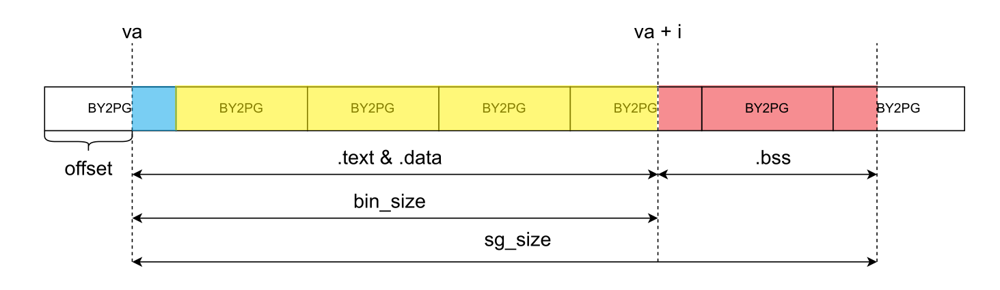

**目录**
[TOC]
---

# 思考题

## Thinking 3.1

将进程内的页目录自映射到进程内的页表，并将其设置为只读。

## Thinking 3.2

`void *data`的最终来源是函数`load_icode`中的`struct Env *e`.

它的作用是指定程序要加载到的进程。

没有这个参数不可以，因为那样无法保证将程序加载到了当前的进程地址。

## Thinking 3.3

如下图所示，若`offset!=0`, 则需要先加载不对齐的蓝色区域，紧接着加载黄色区域，最后加载红色区域。

若`offset==0`, 则蓝色区域不存在，只存在对齐的黄色区域和红色区域。



## Thinking 3.4

虚拟地址。

## Thinking 3.5

位于`genex.S`和`traps.c`中。

## Thinking 3.6

采用逐行注释的方法解释代码。

`enable_irq`:

```assembly
# 定义函数的宏
LEAF(enable_irq)
	# 下面两行设置CP0中CU0寄存器的值以设置时钟中断
	li		t0, (STATUS_CU0 | STATUS_IM4 | STATUS_IEc)
	mtc0	t0, CP0_STATUS
	# 跳回函数调用处
	jr		ra
# 结束函数定义的宏
END(enable_irq)
```

`timer_irq`:

```assembly
# 函数入口
timer_irq:
	# 写特定地址以相应时钟中断
	sw		zero, (KSEG1 | DEV_RTC_ADDRESS | DEV_RTC_INTERRUPT_ACK)
	# 设置函数返回值
	li		a0, 0
	# 跳入schedule函数以切换进程
	j		schedule
```

## Thinking 3.7

使用`round-robin`算法调度各进程。使用`count`来记录进程剩余的时间片，使用`yield`判断是否需要立刻切换进程。通过维护`env_sched_list`进行进程切换。

# 难点分析

以下是我在实验中遇到的几个难点：

1. 进程控制块的设计与实现。进程控制块是跟踪进程状态的重要数据结构。在设计和实现进程控制块时，需要考虑到许多细节，例如如何保存进程的上下文、如何切换进程的执行、如何防止进程访问非法内存等。需要仔细考虑这些问题，并确保实现的控制块能够正常工作。
2. 时钟中断的处理。时钟中断是操作系统中非常重要的机制，它允许操作系统周期性地获得执行权。在实现时钟中断处理函数时，需要考虑到许多问题，例如如何保存当前进程的上下文、如何更新进程状态、如何选择下一个进程等。需要仔细设计和测试这些处理函数，并确保它们能够正确地工作。
3. 进程调度的实现。进程调度是许多操作系统的核心功能之一，它决定了哪个进程能够获得执行权。在实现进程调度时，需要考虑到许多问题，例如如何公平地分配CPU时间片、如何避免死锁、如何处理优先级等。需要仔细研究和测试这些问题，并确保实现的进程调度算法能够正确地工作。
4. 用户模式下的程序执行。在本实验中，我们需要在用户模式下执行程序，并将程序镜像加载到指定的内存空间中。这需要对操作系统的内存管理机制有深入的了解，并且需要确保程序能够正确地运行。

# 实验体会

这篇实验需要实现进程创建、时钟中断和进程调度等基本操作。通过完成这个实验，我深刻理解了操作系统的基本原理和实现方式。

在实验中，我首先学习了进程控制块 Env 的数据结构，它被用来跟踪用户进程的状态。我在代码中实现了创建进程的函数，并能够将进程加入到进程队列中，实现了进程的基本创建和调度。

接下来，我实现了时钟中断的处理函数。时钟中断可以在内核中断处理程序中被捕获，它允许内核在某个时间间隔后重新获得执行权。在处理函数中，我实现了基本的时钟中断处理逻辑，包括保存当前进程的上下文、更新进程状态和重新调度下一个进程等。

最后，我实现了进程调度功能，包括创建两个进程并切换它们的执行。在这个过程中，我遵循了操作系统的基本原则，尽可能公平地分配CPU时间片，确保每个进程都有机会运行。我还学习了如何在用户模式下运行程序，并将程序镜像加载到指定的内存空间中。

总体来说，这个实验是一次非常有益的学习经历。我学习了如何使用数据结构来跟踪进程，了解了时钟中断和进程调度的基本原理，并在代码中实现了这些功能。这让我更好地理解了操作系统的基本原理和实现方式，也让我更加自信地掌握了编写操作系统的能力。