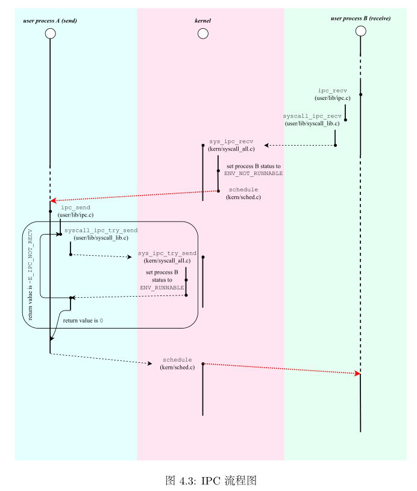
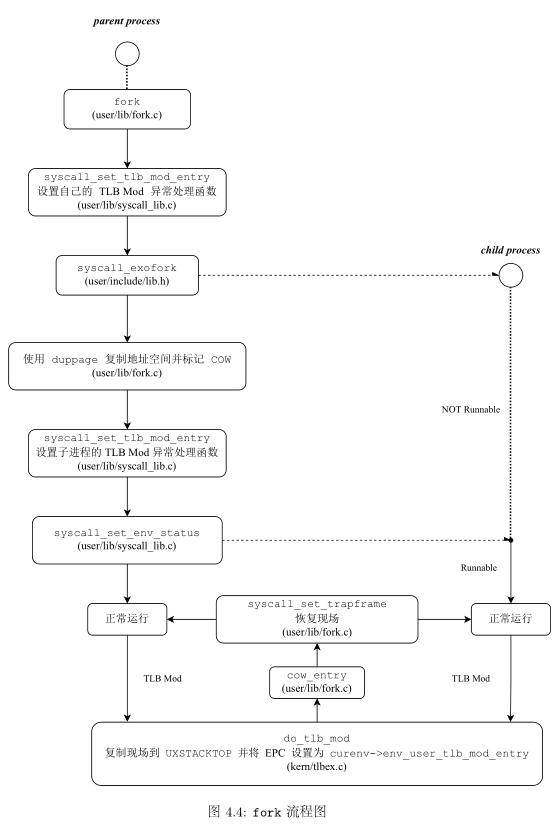

**目录**

[TOC]

---

# 思考题

## Thinking 4.1

- 需要保存现场时，使用`SAVE_ALL`宏来保存所有通用寄存器。在返回函数时，使用`RESTORE_SOME`宏来恢复通用寄存器的值。
- 可以。
- 在进入`sys_*`函数时将参数存到了寄存器和栈中。
- 将`EPC`加上`4`，并将函数返回值存入寄存器`v0`中。返回用户态时，将从系统调用的下一条指令开始执行，同时得到系统调用的返回值。

## Thinking 4.2

我们仅使用了`envid`的地位来获取`env`. 但是`envid`的高位也要相同，才能保证得到了想要的`env`.

## Thinking 4.3

我们将`envid`为`0`的情况视为当前进程。

## Thinking 4.4

C.

## Thinking 4.5

`UTEXT`以下，且标识位`PTE_V`有效的，需要保护的页面。

## Thinking 4.6

- `vpt`是第一个页表项的地址。`vpd`是第一个页目录项的地址。这样使用它们：`vpt[*]`.
- 因为这一部分内存是暴露给用户进程的。
- 页目录本身属于一页页表。
- 不能。

## Thinking 4.7

- 在处理中断时再次遇到中断时。例如，在处理缺页异常时又遇到了缺页异常。
- 因为用户要用。比如获取异常处理的返回值。

## Thinking 4.8

轻量快速，符合为微内核的设计理念。

## Thinking 4.9

- 因为在执行`syscall_fork`时也有可能发生异常，所以要提前设置好异常处理的入口。
- 写时复制触发缺页中断时，无法正常处理异常。

# 难点分析

Lab4综合了之前Lab的内容，同时加入了新的内容。实验的难点主要在于理解和掌握操作系统的核心原理和机制，例如内存管理、进程调度、IPC 机制、TLB 管理等，需要了解并掌握汇编语言、C 语言和操作系统的底层实现方式。同时，因为实验涉及到的内容较多，还需要注意错误处理和调试技巧。

1. msyscall 函数：这个函数是用户态进程和内核态的接口函数，负责传递系统调用号和参数，以及从内核态返回系统调用的结果。实现这个函数需要了解汇编语言和内核态、用户态之间的交互机制。
2. do_syscall_* 函数：这组函数是内核中实际处理系统调用的函数，根据系统调用号调用相应的内核函数，并传递参数和返回值。实现这组函数需要了解系统调用的流程和内核中各种系统调用的实现方式。
3. envid2env 函数：这个函数用于将环境 ID 转换为对应的 env 结构体指针。实现这个函数需要了解环境 ID 和 env 结构体之间的映射关系，以及内存管理中的页表和虚拟地址的转换。
4. sys_mem_alloc 函数：这个函数用于分配一页物理内存，并映射到指定的虚拟地址上。实现这个函数需要了解物理内存和虚拟内存的管理方式，以及如何将虚拟地址映射到物理地址上。
5. sys_mem_map 函数：这个函数用于将一段物理地址映射到指定的虚拟地址上。实现这个函数需要了解虚拟内存和物理内存的映射关系，以及如何管理页表和缺页异常。
6. sys_mem_unmap 函数：这个函数用于解除一个虚拟地址和物理地址的映射关系。实现这个函数需要了解虚拟内存和物理内存的映射关系，以及如何管理页表和缺页异常。
7. sys_yield 函数：这个函数用于将当前进程放弃 CPU 控制权，切换到另一个就绪进程上。实现这个函数需要了解进程调度和上下文切换的机制，以及如何保存和恢复进程的执行状态。
8. sys_ipc_recv 函数和 sys_ipc_try_send 函数：这两个函数用于实现进程之间的 IPC 机制。实现这些函数需要了解 IPC 机制的原理，以及如何进行消息传递和信号量等操作。
9. sys_exofork 函数和 duppage 函数：这两个函数用于实现 fork 函数。实现这些函数需要了解进程控制、虚拟内存和物理内存的管理方式，以及如何处理进程间的共享和复制等问题。
10. do_tlb_mod 函数和 sys_set_tlb_mod_entry 函数：这两个函数用于实现 TLB（快表）的管理。实现这些函数需要了解 TLB 的结构和管理方式，以及如何实现 TLB 的修改和失效等操作。
11. cow_entry 函数：这个函数用于处理写时复制（Copy On Write）机制，实现共享内存时需要用到。实现这个函数需要了解写时复制的原理和实现方式，以及如何利用 TLB 实现写时复制。
12. sys_set_env_status 函数：这个函数用于设置进程的状态，如 RUNNABLE、FREE 等状态。实现这个函数需要了解进程状态的转换和管理方式。
13. fork 函数：这个函数是用户程序调用的函数，用于创建新的进程。实现这个函数需要了解进程的创建和控制机制，以及如何实现进程的复制和共享等操作。

# 实验体会

通过编写代码实现系统调用的功能，我深刻理解了系统调用的概念和流程，学会了如何使用系统调用来调用操作系统提供的服务，比如分配内存、映射内存等。同时，我也了解了系统调用的实现原理，包括用户态和内核态的切换过程以及如何使用中断实现系统调用。

进程间通信是多个进程之间进行数据交换和协调的机制，是操作系统中非常重要的一个概念。本次实验中，我学会了如何在程序中使用IPC机制来实现进程间的通信。

fork函数是操作系统中非常重要的一个函数，它可以实现创建新进程的功能。在本次实验中，我深入理解了fork函数的实现原理，并通过代码实现了fork函数的功能。同时，我也了解了操作系统中进程的概念和管理方式，包括进程控制块、进程调度等，并学会了如何使用fork函数创建新进程并对进程进行管理。

页写入异常是操作系统中的一个非常重要的异常处理机制，它可以防止程序错误地写入内存并导致系统崩溃。在本次实验中，我了解了页写入异常的概念和原理，并学会了如何使用页写入异常处理机制来保护系统的安全和稳定性。