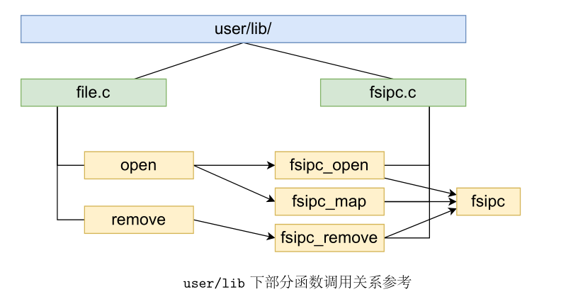

**目录**

[TOC]
---

# 思考题

## Thinking 5.1

通过kseg0读写设备并将写入缓存到Cache中可能会引发以下问题：

1. 数据不同步：当设备的写入被缓存时，缓存中的数据与实际设备中的数据可能不同步。这意味着在读取缓存的数据时，可能会读取到旧的设备数据而不是最新的数据。这可能导致设备之间的通信问题或数据的不正确性。
2. 不可预知的结果：由于缓存的存在，设备的写入操作可能不会立即反映在实际设备上。这会导致代码执行的结果变得不可预测，因为无法确定何时设备中的数据会被更新。这可能导致程序逻辑错误或产生难以调试的问题。

对于不同种类的设备，如串口设备和IDE磁盘，操作可能存在差异：

1. 串口设备：串口通信通常是基于实时性要求较高的场景。如果将串口设备的写入缓存到Cache中，可能会导致数据的延迟传输或乱序传输。这可能会影响与其他设备或系统的通信，并导致数据传输错误。
2. IDE磁盘：IDE磁盘通常用于存储数据，并且对数据的一致性要求较高。将IDE磁盘的写入缓存到Cache中可能会导致数据写入不及时或丢失。这可能会导致文件系统错误、数据损坏或丢失。

## Thinking 5.2

最多能储存$BY2BLK/BY2FILE=16$个文件控制块。

一个目录下最多有$16 * 1024=16384$个文件。

单个文件最大为$1024*4096=4MB$.

## Thinking 5.3

$0x40000000=1GB$.

## Thinking 5.4

`#define FS_MAGIC 0x68286097`

这个宏定义了每个人最爱的操作系统课程，用来识别文件系统是否合法。这在我看来无比重要。

`#define BY2BLK BY2PG`

这个宏定义了块的大小为页大小，实现了文件系统与页式管理系统的完美结合。这在我看来无比重要。

## Thinking 5.5

会。

```c
int main() {
	int fd;
    try(fd = open("/temp", O_RDWR));
	seek(fd, 114514)
    int pid = fork();
    if (pid == 0) {
        struct Fd *_fd;
        if (fd_lookup(fd, &_fd) < 0) {
            debugf("fail\n");
        } else {
            debugf("sucess\n");
        }
    }
    return 0;
}
```

## Thinking 5.6

```c
struct File {
    chat f_name[MAXNAMELEN];
    uint32_t f_size;
    uint32_t f_type;
    uint32_t f_direct[NDIRECT];
    uint32_t f_indirect;
    
    struct File *f_dir;
}
```

从上到下各个域依次为：文件名，文件大小，文件类型，文件块指针，储存文件块指针的块的指针，文件所在目录指针。

对应文件。

```c
struct Fd {
    u_int fd_dev_id;
    u_int fd_offset;
    u_int fd_omode;
}
```

从上到下各个域依次为：设备id，读写位置，文件打开模式。

对应文件。

```c
struct Filefd {
    struct Fd f_fd;
    u_int f_fileid;
    struct File f_file;
}
```

从上到下各个域依次为：文件描述符Fd，文件id，文件File。

对应文件。

## Thinking 5.7

从上到下箭头的意义分别为：创建用户进程，创建文件系统进程，用户进程向文件系统发送请求，文件系统向用户进程返回结果。


# 难点分析

1. 完成 `sys_write_dev` 和 `sys_read_dev`：
   - 难点：这两个函数是在内核中实现系统调用的一部分，涉及用户空间和内核空间之间的参数传递和数据交互。需要了解内核中系统调用的实现机制，并正确处理参数和数据的传递，以及错误处理和返回值的管理。
2. 完成 `map_block` 和 `unmap_block`：
   - 难点：`map_block` 和 `unmap_block` 是文件系统中块映射和解除映射的函数。需要正确地管理块的映射关系，包括更新块映射表、处理块的分配和释放等。需要考虑并发访问、同步机制和错误处理。
3. 完成 `open`：
   - 难点：`open` 是文件系统中打开文件的函数。需要实现打开文件的操作，包括获取文件的元数据、分配和管理文件描述符等。需要考虑文件打开模式、并发访问和错误处理。



# 实验体会

1. 细致的计划和设计是关键：文件系统是一个复杂的系统，涉及多个功能和模块的实现。在开始实验之前，进行详细的计划和设计是至关重要的。理解每个任务的要求、依赖关系和实现步骤，制定清晰的计划和时间表，有助于确保实验的顺利进行。
2. 深入理解文件系统原理：为了成功完成这些任务，深入理解文件系统的原理和内部工作机制是必不可少的。学习相关的文件系统理论和概念，了解磁盘管理、块映射、目录结构、文件访问等方面的知识，可以为实验提供必要的基础。
3. 仔细阅读文档和代码：对于每个任务，仔细阅读相关的文档和代码是至关重要的。了解所涉及的函数、数据结构和算法，理解代码的逻辑和实现细节，可以帮助更好地理解和实现任务要求。
4. 深入分析和理解实验结果：完成实验后，对实验结果进行深入分析和理解是非常重要的。评估实现的功能是否符合预期，分析实验结果中的问题和限制，并思考可能的改进方向。这种深入的分析有助于对文件系统的设计和实现有更全面的认识，并为进一步的研究和实验提供指导。