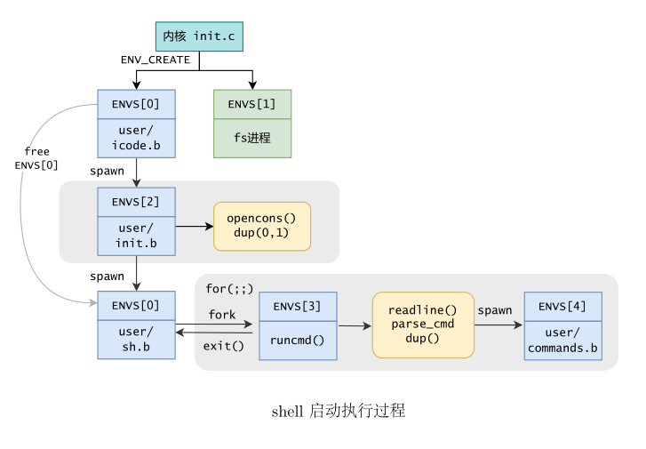

**目录**

[TOC]
---

# 思考题

## Thinking 6.1

改成让父进程关闭写端，子进程关闭读端即可。

```c
case 0:
	close(fildes[0]);
	...
default:
	close(fildes[1]);
	...
```


## Thinking 6.2

`dup`函数中先对`fd`进行映射，再对`pipe`映射，这个顺序可能会出现`pageref(fd) == pageref(pipe)`的情况。

## Thinking 6.3

在陷入内核时，系统会关闭时钟中断，从而实现原子操作。

## Thinking 6.4

- 可以。交换顺序后始终有`pageref(pipe) > pageref(fd)`.
- 会。在Thinking6.2中已经分析过了。

## Thinking 6.5

在`load_icode_seg`函数中，当`bin_size < sgsize`时，我们回调了`load_icode_mapper`函数将剩余的段填入了0，这时`.bss`段的数据也被填入了0.

## Thinking 6.6

在`user/init.c`中，以下代码段设置了标准输入输出。

```c
	// stdin should be 0, because no file descriptors are open yet
	if ((r = opencons()) != 0) {
		user_panic("opencons: %d", r);
	}
	// stdout
	if ((r = dup(0, 1)) < 0) {
		user_panic("dup: %d", r);
	}

```

## Thinking 6.7

在MOS中是外部命令。

cd命令是改变当前shell的目录，因此不应fork一个新shell。

## Thinking 6.8

输出如下：

```shell
[00002803] pipecreate 
[00003805] destroying 00003805
[00003805] free env 00003805
i am killed ... 
[00004006] destroying 00004006
[00004006] free env 00004006
i am killed ... 
[00003004] destroying 00003004
[00003004] free env 00003004
i am killed ... 
[00002803] destroying 00002803
[00002803] free env 00002803
i am killed ... 
```

shell输出中没有spawn信息。但是可以推测出发生了两次spawn。

shell输出中可以观察到4次进程销毁，分别对应`|, >, ls.b, cat.b`.


# 难点分析

1. 填写 `pipe_read`、`pipe_write`、`_pipe_is_closed` 函数：
   - 难点：实现管道的读取和写入功能需要考虑多个进程之间的并发访问和同步。需要确保数据在管道中正确地传递，并处理读取和写入的边界情况。同时，需要正确处理管道的打开和关闭状态，以及错误处理。
2. 修改 `pipe_close` 函数：
   - 难点：修改管道关闭函数可能涉及到多个进程之间的同步和资源释放。需要考虑管道是否有其他进程正在读取或写入，并决定何时可以安全地关闭管道。还需确保在管道关闭后，相应的资源得到正确释放，以避免资源泄漏。
3. 修改 `dup` 函数：
   - 难点：`dup` 函数用于复制文件描述符，需要确保复制后的文件描述符与原始文件描述符共享相同的文件表项。可能需要修改文件表项的数据结构，并确保在多个文件描述符引用同一文件时，文件操作的正确性和一致性。
4. 完成 `spawn` 函数：
   - 难点：`spawn` 函数用于创建新进程。可能需要涉及进程的创建、上下文切换和资源分配等方面的知识。需要正确处理父子进程之间的通信和同步，以及确保新进程能够正确执行所需的程序。
5. 完成 `parsecmd` 函数：
   - 难点：`parsecmd` 函数用于解析命令行输入，并将其转换为可执行的命令和参数。需要考虑命令行输入的各种格式和边界情况，并将其正确解析为可执行的指令。



# 实验体会

通过完成这些任务，我对操作系统的内部机制和概念有了更深入的理解。实现管道的读取和写入功能让我熟悉了进程间的并发访问和同步问题。修改管道关闭和文件描述符复制函数使我加深了对资源管理和进程通信的认识。完成进程创建和命令行解析函数让我更熟练地处理进程管理和命令行输入。这些实验锻炼了我在操作系统开发方面的能力，提高了我解决问题和调试代码的技巧。